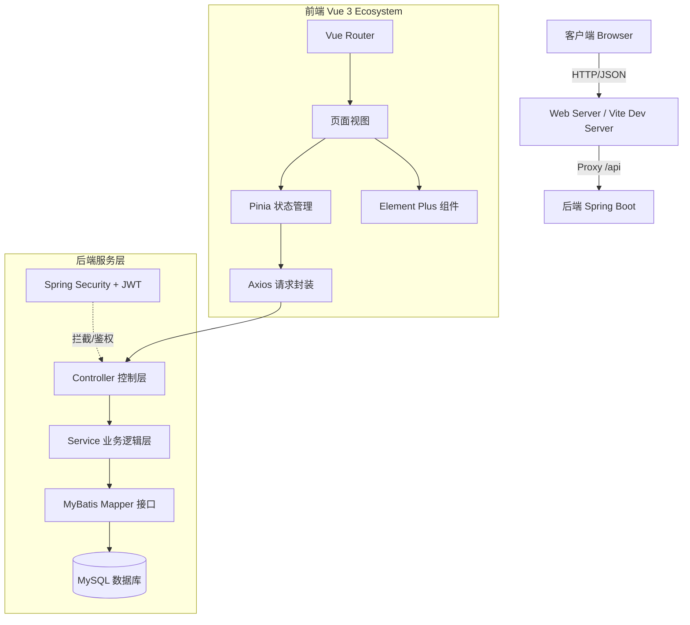

# 项目技术分析报告：学生成长档案与家校互动管理平台

## 1. 核心总结

本项目是一个基于 **Spring Boot + Vue 3** 的 B/S 架构教育管理系统，旨在解决学校、教师与家长之间信息不对称的问题，并实现学生成长数据的数字化管理。

**核心功能**：
*   **多角色管理**：支持管理员、教师、学生、家长四种角色，拥有不同的操作权限。
*   **成长档案**：全方位记录学生的学籍信息、考试成绩、获奖记录及综合素质评价。
*   **家校互动**：提供通知公告发布、教师与家长的点对点消息留言功能。
*   **数据可视化**：通过仪表盘和图表（ECharts）直观展示学生统计数据及成绩趋势。

**解决的核心问题**：
*   传统纸质档案管理效率低、查询难。
*   家校沟通渠道单一，信息传递不及时。
*   学生成绩数据缺乏多维度的统计与分析。

---

## 2. 架构与逻辑

### 2.1 系统架构图

系统采用经典的前后端分离架构：



### 2.2 核心业务逻辑与算法原理

#### 2.2.1 认证与授权 (RBAC)
*   **原理**：采用无状态的 **JWT (JSON Web Token)** 认证机制。
*   **流程**：
    1.  用户登录成功后，后端签发包含用户 ID 和 Role 的 Token。
    2.  前端将 Token 存储在 `sessionStorage` 中，并在后续请求头 `Authorization` 中携带。
    3.  后端通过 `JwtAuthenticationFilter` 拦截请求，解析 Token 并构建 `Authentication` 对象放入 `SecurityContext`。
    4.  使用 `@PreAuthorize("hasRole('ADMIN')")` 注解在方法级别控制访问权限。
*   **代码映射**：
    *   过滤器：`backend/src/main/java/com/student/growth/filter/JwtAuthenticationFilter.java`
    *   配置：`backend/src/main/java/com/student/growth/config/SecurityConfig.java`

#### 2.2.2 数据权限隔离
*   **原理**：在业务代码中根据当前登录用户的 ID 过滤数据。
*   **逻辑**：
    *   **家长**：只能查询自己绑定的学生数据（通过 `student_info` 表中的 `parent_id` 关联）。
    *   **教师**：只能查询自己所教班级的学生数据（通过 `class_id` 关联）。
*   **代码映射**：
    *   `StudentController.java` 中的 `getMyStudents()` 和 `getTeacherStudents()` 方法。

#### 2.2.3 成绩统计算法
*   **原理**：利用 Java Stream API 对数据库查询结果进行内存计算。
*   **逻辑**：
    *   **单科统计**：按科目分组，计算 `average` (平均分), `max`, `min`。
    *   **总分趋势**：按 `examDate` 分组，对同一次考试的所有科目成绩求和 (`Collectors.summingDouble`)，生成时间序列数据供前端 ECharts 渲染。
*   **代码映射**：
    *   `backend/src/main/java/com/student/growth/controller/StatisticsController.java`

---

## 3. 接口与依赖

### 3.1 数据结构

**输入/输出格式**：统一采用 JSON 格式。
*   **通用响应结构** (`Result<T>`)：
    ```json
    {
      "code": 200,      // 状态码
      "message": "成功", // 提示信息
      "data": { ... }   // 业务数据
    }
    ```

### 3.2 关键依赖

**后端 (Maven `pom.xml`)**：
*   `spring-boot-starter-web`: Web 核心组件。
*   `spring-boot-starter-security`: 安全框架。
*   `mybatis-plus-spring-boot3-starter`: ORM 框架，简化 SQL 操作。
*   `jjwt`: JWT 生成与解析库。
*   `mysql-connector-j`: MySQL 驱动。
*   `hutool-all`: Java 工具包（加密、日期处理等）。

**前端 (NPM `package.json`)**：
*   `vue`: 核心框架 (v3.4)。
*   `vue-router`: 路由管理。
*   `pinia`: 状态管理。
*   `axios`: HTTP 客户端。
*   `element-plus`: UI 组件库。
*   `echarts`: 图表库。

---

## 4. 关键代码附录

以下是理解系统运作的核心代码片段。

### 4.1 后端安全配置 (SecurityConfig.java)
负责配置 HTTP 安全策略、CORS 跨域及过滤器链。

```java
// backend/src/main/java/com/student/growth/config/SecurityConfig.java
@Configuration
@EnableWebSecurity
@EnableMethodSecurity // 开启注解权限控制
public class SecurityConfig {

    private final JwtAuthenticationFilter jwtAuthenticationFilter;

    // ... 构造函数注入 ...

    @Bean
    public SecurityFilterChain securityFilterChain(HttpSecurity http) throws Exception {
        http
            .csrf(AbstractHttpConfigurer::disable) // 禁用 CSRF
            .cors(cors -> cors.configurationSource(corsConfigurationSource())) // 配置跨域
            .sessionManagement(session -> session.sessionCreationPolicy(SessionCreationPolicy.STATELESS)) // 无状态 Session
            .authorizeHttpRequests(auth -> auth
                    .requestMatchers("/auth/**").permitAll() // 放行认证接口
                    .anyRequest().authenticated() // 其他接口需认证
            )
            .addFilterBefore(jwtAuthenticationFilter, UsernamePasswordAuthenticationFilter.class); // 添加 JWT 过滤器

        return http.build();
    }
    
    // ... CORS 配置 ...
}
```

### 4.2 统计业务逻辑 (StatisticsController.java)
展示了如何聚合数据生成报表。

```java
// backend/src/main/java/com/student/growth/controller/StatisticsController.java
@GetMapping("/score/trend/{studentId}")
public Result<Map<String, Object>> getScoreTrend(
        @PathVariable Long studentId,
        @RequestParam(required = false) String subject) {
    
    // 1. 查询该学生所有成绩
    LambdaQueryWrapper<ScoreRecord> wrapper = new LambdaQueryWrapper<ScoreRecord>()
            .eq(ScoreRecord::getStudentId, studentId)
            .orderByAsc(ScoreRecord::getExamDate);
    List<ScoreRecord> scores = scoreRecordService.list(wrapper);

    // 2. 数据处理
    if (subject != null && !subject.isEmpty()) {
        // 单科趋势：直接过滤
        scores = scores.stream()
                .filter(s -> s.getSubject().equals(subject))
                .collect(Collectors.toList());
        // ... 填充 dates 和 scoreValues
    } else {
        // 总成绩趋势：按日期聚合求和
        Map<String, Double> sumByDate = scores.stream()
                .collect(Collectors.groupingBy(
                        s -> s.getExamDate().toString(),
                        Collectors.summingDouble(s -> s.getScore().doubleValue())
                ));
        // ... 排序并填充 ...
    }
    // ... 返回结果 ...
}
```

### 4.3 前端请求封装 (request.js)
统一处理 Token 注入和响应拦截。

```javascript
// frontend/src/utils/request.js
const request = axios.create({
  baseURL: '/api', // 配合 Vite 代理
  timeout: 10000
})

// 请求拦截器：自动携带 Token
request.interceptors.request.use(
  config => {
    const token = sessionStorage.getItem('token')
    if (token) {
      config.headers.Authorization = `Bearer ${token}`
    }
    return config
  },
  // ...
)

// 响应拦截器：统一处理错误
request.interceptors.response.use(
  response => {
    const res = response.data
    if (res.code === 200) {
      return res
    } else {
      // 处理业务错误
      ElMessage.error(res.message || '请求失败')
      return Promise.reject(new Error(res.message))
    }
  },
  error => {
    // 处理 401 未授权（Token 过期）
    if (error.response && error.response.status === 401) {
      sessionStorage.removeItem('token')
      router.push('/login')
    }
    return Promise.reject(error)
  }
)
```

### 4.4 前端路由守卫 (router/index.js)
实现前端的页面访问权限控制。

```javascript
// frontend/src/router/index.js
router.beforeEach((to, from, next) => {
  const userStore = useUserStore()
  const token = userStore.token

  if (!token) {
    // 未登录：重定向到登录页
    if (to.path === '/login' || to.path === '/register') {
      next()
    } else {
      next('/login')
    }
  } else {
    // 已登录：检查角色权限
    if (to.meta.roles && !to.meta.roles.includes(userStore.userInfo?.role)) {
      ElMessage.error('无权访问')
      next('/')
    } else {
      next()
    }
  }
})
```


## 5. 瀹屾暣婧愪唬鐮侀檮褰?

### backend/pom.xml
```xml
<?xml version="1.0" encoding="UTF-8"?>
<project xmlns="http://maven.apache.org/POM/4.0.0"
         xmlns:xsi="http://www.w3.org/2001/XMLSchema-instance"
         xsi:schemaLocation="http://maven.apache.org/POM/4.0.0
         http://maven.apache.org/xsd/maven-4.0.0.xsd">
    <modelVersion>4.0.0</modelVersion>

    <parent>
        <groupId>org.springframework.boot</groupId>
        <artifactId>spring-boot-starter-parent</artifactId>
        <version>3.2.0</version>
        <relativePath/>
    </parent>

    <groupId>com.student</groupId>
    <artifactId>student-growth-system</artifactId>
    <version>1.0.0</version>
    <name>Student Growth System</name>
    <description>瀛︾敓鎴愰暱妗ｆ涓庡鏍′簰鍔ㄧ鐞嗗钩鍙?/description>

    <properties>
        <java.version>17</java.version>
        <mybatis-plus.version>3.5.5</mybatis-plus.version>
        <jwt.version>0.12.3</jwt.version>
        <hutool.version>5.8.24</hutool.version>
    </properties>

    <dependencies>
        <dependency>
            <groupId>org.springframework.boot</groupId>
            <artifactId>spring-boot-starter-web</artifactId>
        </dependency>

        <dependency>
            <groupId>org.springframework.boot</groupId>
            <artifactId>spring-boot-starter-validation</artifactId>
        </dependency>

        <dependency>
            <groupId>org.springframework.boot</groupId>
            <artifactId>spring-boot-starter-security</artifactId>
        </dependency>

        <dependency>
            <groupId>com.baomidou</groupId>
            <artifactId>mybatis-plus-spring-boot3-starter</artifactId>
            <version>${mybatis-plus.version}</version>
        </dependency>

        <dependency>
            <groupId>com.mysql</groupId>
            <artifactId>mysql-connector-j</artifactId>
            <scope>runtime</scope>
        </dependency>

        <dependency>
            <groupId>io.jsonwebtoken</groupId>
            <artifactId>jjwt-api</artifactId>
            <version>${jwt.version}</version>
        </dependency>
        <dependency>
            <groupId>io.jsonwebtoken</groupId>
            <artifactId>jjwt-impl</artifactId>
            <version>${jwt.version}</version>
            <scope>runtime</scope>
        </dependency>
        <dependency>
            <groupId>io.jsonwebtoken</groupId>
            <artifactId>jjwt-jackson</artifactId>
            <version>${jwt.version}</version>
            <scope>runtime</scope>
        </dependency>

        <dependency>
            <groupId>cn.hutool</groupId>
            <artifactId>hutool-all</artifactId>
            <version>${hutool.version}</version>
        </dependency>

        <dependency>
            <groupId>org.projectlombok</groupId>
            <artifactId>lombok</artifactId>
            <optional>true</optional>
        </dependency>

        <dependency>
            <groupId>org.springframework.boot</groupId>
            <artifactId>spring-boot-starter-test</artifactId>
            <scope>test</scope>
        </dependency>
    </dependencies>

    <build>
        <plugins>
            <plugin>
                <groupId>org.springframework.boot</groupId>
                <artifactId>spring-boot-maven-plugin</artifactId>
                <configuration>
                    <excludes>
                        <exclude>
                            <groupId>org.projectlombok</groupId>
                            <artifactId>lombok</artifactId>
                        </exclude>
                    </excludes>
                </configuration>
            </plugin>
        </plugins>
    </build>
</project>
```

### backend/src/main/resources/application.yml
```yaml
spring:
  application:
    name: student-growth-system
  datasource:
    driver-class-name: com.mysql.cj.jdbc.Driver
    url: jdbc:mysql://localhost:3306/student_growth?useUnicode=true&characterEncoding=utf8&useSSL=false&serverTimezone=Asia/Shanghai
    username: root
    password: 123456

mybatis-plus:
  configuration:
    map-underscore-to-camel-case: true
    log-impl: org.apache.ibatis.logging.stdout.StdOutImpl
  global-config:
    db-config:
      id-type: auto
      logic-delete-field: deleted
      logic-delete-value: 1
      logic-not-delete-value: 0

jwt:
  secret: student-growth-system-secret-key-2024
  expiration: 86400000

server:
  port: 8080
  servlet:
    context-path: /api
```

### backend/src/main/resources/schema.sql
```sql
-- 鍒涘缓鏁版嵁搴?CREATE DATABASE IF NOT EXISTS student_growth DEFAULT CHARACTER SET utf8mb4 COLLATE utf8mb4_unicode_ci;

USE student_growth;

-- 鐢ㄦ埛琛?CREATE TABLE `sys_user` (
  `id` BIGINT NOT NULL AUTO_INCREMENT COMMENT '鐢ㄦ埛ID',
  `username` VARCHAR(50) NOT NULL COMMENT '鐢ㄦ埛鍚?,
  `password` VARCHAR(255) NOT NULL COMMENT '瀵嗙爜',
  `real_name` VARCHAR(50) NOT NULL COMMENT '鐪熷疄濮撳悕',
  `phone` VARCHAR(20) COMMENT '鎵嬫満鍙?,
  `email` VARCHAR(100) COMMENT '閭',
  `role` VARCHAR(20) NOT NULL COMMENT '瑙掕壊锛欰DMIN/TEACHER/STUDENT/PARENT',
  `avatar` VARCHAR(255) COMMENT '澶村儚',
  `status` TINYINT DEFAULT 1 COMMENT '鐘舵€侊細0-绂佺敤 1-鍚敤',
  `deleted` TINYINT DEFAULT 0 COMMENT '鍒犻櫎鏍囪',
  `create_time` DATETIME DEFAULT CURRENT_TIMESTAMP COMMENT '鍒涘缓鏃堕棿',
  `update_time` DATETIME DEFAULT CURRENT_TIMESTAMP ON UPDATE CURRENT_TIMESTAMP COMMENT '鏇存柊鏃堕棿',
  PRIMARY KEY (`id`),
  UNIQUE KEY `uk_username` (`username`)
) ENGINE=InnoDB DEFAULT CHARSET=utf8mb4 COMMENT='鐢ㄦ埛琛?;

-- 瀛︾敓淇℃伅琛?CREATE TABLE `student_info` (
  `id` BIGINT NOT NULL AUTO_INCREMENT COMMENT '瀛︾敓ID',
  `user_id` int  NULL COMMENT '鐢ㄦ埛ID',
  `name` VARCHAR(50) DEFAULT NULL COMMENT '瀛︾敓濮撳悕',
  `student_no` VARCHAR(50) NOT NULL COMMENT '瀛﹀彿',
  `class_id` BIGINT COMMENT '鐝骇ID',
  `class_name` VARCHAR(50) DEFAULT NULL COMMENT '鐝骇鍚嶇О',
  `gender` VARCHAR(10) COMMENT '鎬у埆',
  `birthday` DATE COMMENT '鐢熸棩',
  `id_card` VARCHAR(18) COMMENT '韬唤璇佸彿',
  `address` VARCHAR(255) COMMENT '瀹跺涵浣忓潃',
  `parent_id` BIGINT COMMENT '瀹堕暱鐢ㄦ埛ID',
  `enrollment_date` DATE COMMENT '鍏ュ鏃ユ湡',
  `deleted` TINYINT DEFAULT 0 COMMENT '鍒犻櫎鏍囪',
  `create_time` DATETIME DEFAULT CURRENT_TIMESTAMP COMMENT '鍒涘缓鏃堕棿',
  `update_time` DATETIME DEFAULT CURRENT_TIMESTAMP ON UPDATE CURRENT_TIMESTAMP COMMENT '鏇存柊鏃堕棿',
  PRIMARY KEY (`id`),
  UNIQUE KEY `uk_student_no` (`student_no`),
  KEY `idx_user_id` (`user_id`),
  KEY `idx_class_id` (`class_id`)
) ENGINE=InnoDB DEFAULT CHARSET=utf8mb4 COMMENT='瀛︾敓淇℃伅琛?;

-- 鐝骇琛?CREATE TABLE `class_info` (
  `id` BIGINT NOT NULL AUTO_INCREMENT COMMENT '鐝骇ID',
  `class_name` VARCHAR(50) NOT NULL COMMENT '鐝骇鍚嶇О',
  `grade` VARCHAR(20) NOT NULL COMMENT '骞寸骇',
  `teacher_id` BIGINT COMMENT '鐝富浠籌D',
  `deleted` TINYINT DEFAULT 0 COMMENT '鍒犻櫎鏍囪',
  `create_time` DATETIME DEFAULT CURRENT_TIMESTAMP COMMENT '鍒涘缓鏃堕棿',
  `update_time` DATETIME DEFAULT CURRENT_TIMESTAMP ON UPDATE CURRENT_TIMESTAMP COMMENT '鏇存柊鏃堕棿',
  PRIMARY KEY (`id`)
) ENGINE=InnoDB DEFAULT CHARSET=utf8mb4 COMMENT='鐝骇琛?;

-- 鎴愮哗璁板綍琛?CREATE TABLE `score_record` (
  `id` BIGINT NOT NULL AUTO_INCREMENT COMMENT '鎴愮哗ID',
  `student_id` BIGINT NOT NULL COMMENT '瀛︾敓ID',
  `student_name` VARCHAR(50) DEFAULT NULL COMMENT '瀛︾敓濮撳悕',
  `class_name` VARCHAR(50) DEFAULT NULL COMMENT '鐝骇鍚嶇О',
  `subject` VARCHAR(50) NOT NULL COMMENT '绉戠洰',
  `score` DECIMAL(5,2) NOT NULL COMMENT '鍒嗘暟',
  `exam_type` VARCHAR(50) NOT NULL COMMENT '鑰冭瘯绫诲瀷',
  `exam_date` DATE NOT NULL COMMENT '鑰冭瘯鏃ユ湡',
  `semester` VARCHAR(20) NOT NULL COMMENT '瀛︽湡',
  `teacher_id` BIGINT NOT NULL COMMENT '浠昏鏁欏笀ID',
  `remark` VARCHAR(500) COMMENT '澶囨敞',
  `deleted` TINYINT DEFAULT 0 COMMENT '鍒犻櫎鏍囪',
  `create_time` DATETIME DEFAULT CURRENT_TIMESTAMP COMMENT '鍒涘缓鏃堕棿',
  `update_time` DATETIME DEFAULT CURRENT_TIMESTAMP ON UPDATE CURRENT_TIMESTAMP COMMENT '鏇存柊鏃堕棿',
  PRIMARY KEY (`id`),
  KEY `idx_student_id` (`student_id`),
  KEY `idx_semester` (`semester`)
) ENGINE=InnoDB DEFAULT CHARSET=utf8mb4 COMMENT='鎴愮哗璁板綍琛?;

-- 缁煎悎绱犺川璇勪环琛?CREATE TABLE `comprehensive_evaluation` (
  `id` BIGINT NOT NULL AUTO_INCREMENT COMMENT '璇勪环ID',
  `student_id` BIGINT NOT NULL COMMENT '瀛︾敓ID',
  `student_name` VARCHAR(50) DEFAULT NULL COMMENT '瀛︾敓濮撳悕',
  `class_name` VARCHAR(50) DEFAULT NULL COMMENT '鐝骇鍚嶇О',
  `semester` VARCHAR(20) NOT NULL COMMENT '瀛︽湡',
  `moral_score` INT DEFAULT 0 COMMENT '寰疯偛寰楀垎',
  `intellectual_score` INT DEFAULT 0 COMMENT '鏅鸿偛寰楀垎',
  `physical_score` INT DEFAULT 0 COMMENT '浣撹偛寰楀垎',
  `aesthetic_score` INT DEFAULT 0 COMMENT '缇庤偛寰楀垎',
  `labor_score` INT DEFAULT 0 COMMENT '鍔宠偛寰楀垎',
  `total_score` INT DEFAULT 0 COMMENT '鎬诲垎',
  `level` VARCHAR(20) COMMENT '绛夌骇锛氫紭绉€/鑹ソ/鍚堟牸/寰呮敼杩?,
  `teacher_id` BIGINT NOT NULL COMMENT '璇勪环鏁欏笀ID',
  `remark` TEXT COMMENT '缁煎悎璇勮',
  `deleted` TINYINT DEFAULT 0 COMMENT '鍒犻櫎鏍囪',
  `create_time` DATETIME DEFAULT CURRENT_TIMESTAMP COMMENT '鍒涘缓鏃堕棿',
  `update_time` DATETIME DEFAULT CURRENT_TIMESTAMP ON UPDATE CURRENT_TIMESTAMP COMMENT '鏇存柊鏃堕棿',
  PRIMARY KEY (`id`),
  KEY `idx_student_id` (`student_id`),
  KEY `idx_semester` (`semester`)
) ENGINE=InnoDB DEFAULT CHARSET=utf8mb4 COMMENT='缁煎悎绱犺川璇勪环琛?;

-- 鏁欏笀璇勮琛?CREATE TABLE `teacher_comment` (
  `id` BIGINT NOT NULL AUTO_INCREMENT COMMENT '璇勮ID',
  `student_id` BIGINT NOT NULL COMMENT '瀛︾敓ID',
  `student_name` VARCHAR(50) DEFAULT NULL COMMENT '瀛︾敓濮撳悕',
  `class_name` VARCHAR(50) DEFAULT NULL COMMENT '鐝骇鍚嶇О',
  `teacher_id` BIGINT NOT NULL COMMENT '鏁欏笀ID',
  `comment_type` VARCHAR(20) NOT NULL COMMENT '璇勮绫诲瀷锛歞aily/monthly/term',
  `content` TEXT NOT NULL COMMENT '璇勮鍐呭',
  `comment_date` DATE NOT NULL COMMENT '璇勮鏃ユ湡',
  `deleted` TINYINT DEFAULT 0 COMMENT '鍒犻櫎鏍囪',
  `create_time` DATETIME DEFAULT CURRENT_TIMESTAMP COMMENT '鍒涘缓鏃堕棿',
  `update_time` DATETIME DEFAULT CURRENT_TIMESTAMP ON UPDATE CURRENT_TIMESTAMP COMMENT '鏇存柊鏃堕棿',
  PRIMARY KEY (`id`),
  KEY `idx_student_id` (`student_id`)
) ENGINE=InnoDB DEFAULT CHARSET=utf8mb4 COMMENT='鏁欏笀璇勮琛?;

-- 鑾峰璁板綍琛?CREATE TABLE `award_record` (
  `id` BIGINT NOT NULL AUTO_INCREMENT COMMENT '鑾峰ID',
  `student_id` BIGINT NOT NULL COMMENT '瀛︾敓ID',
  `student_name` VARCHAR(50) DEFAULT NULL COMMENT '瀛︾敓濮撳悕',
  `class_name` VARCHAR(50) DEFAULT NULL COMMENT '鐝骇鍚嶇О',
  `award_name` VARCHAR(100) NOT NULL COMMENT '濂栭」鍚嶇О',
  `award_level` VARCHAR(50) NOT NULL COMMENT '濂栭」绾у埆锛氬浗瀹剁骇/鐪佺骇/甯傜骇/鏍＄骇',
  `award_date` DATE NOT NULL COMMENT '鑾峰鏃ユ湡',
  `issuer` VARCHAR(100) COMMENT '棰佸彂鏈烘瀯',
  `certificate_url` VARCHAR(255) COMMENT '璇佷功鍥剧墖URL',
  `remark` VARCHAR(500) COMMENT '澶囨敞',
  `deleted` TINYINT DEFAULT 0 COMMENT '鍒犻櫎鏍囪',
  `create_time` DATETIME DEFAULT CURRENT_TIMESTAMP COMMENT '鍒涘缓鏃堕棿',
  `update_time` DATETIME DEFAULT CURRENT_TIMESTAMP ON UPDATE CURRENT_TIMESTAMP COMMENT '鏇存柊鏃堕棿',
  PRIMARY KEY (`id`),
  KEY `idx_student_id` (`student_id`)
) ENGINE=InnoDB DEFAULT CHARSET=utf8mb4 COMMENT='鑾峰璁板綍琛?;

-- 瀹舵牎浜掑姩鐣欒█琛?CREATE TABLE `message` (
  `id` BIGINT NOT NULL AUTO_INCREMENT COMMENT '鐣欒█ID',
  `sender_id` BIGINT NOT NULL COMMENT '鍙戦€佽€匢D',
  `receiver_id` BIGINT NOT NULL COMMENT '鎺ユ敹鑰匢D',
  `title` VARCHAR(200) NOT NULL COMMENT '鏍囬',
  `content` TEXT NOT NULL COMMENT '鍐呭',
  `is_read` TINYINT DEFAULT 0 COMMENT '鏄惁宸茶锛?-鏈 1-宸茶',
  `read_time` DATETIME COMMENT '闃呰鏃堕棿',
  `deleted` TINYINT DEFAULT 0 COMMENT '鍒犻櫎鏍囪',
  `create_time` DATETIME DEFAULT CURRENT_TIMESTAMP COMMENT '鍒涘缓鏃堕棿',
  `update_time` DATETIME DEFAULT CURRENT_TIMESTAMP ON UPDATE CURRENT_TIMESTAMP COMMENT '鏇存柊鏃堕棿',
  PRIMARY KEY (`id`),
  KEY `idx_sender_id` (`sender_id`),
  KEY `idx_receiver_id` (`receiver_id`)
) ENGINE=InnoDB DEFAULT CHARSET=utf8mb4 COMMENT='瀹舵牎浜掑姩鐣欒█琛?;

-- 閫氱煡鍏憡琛?CREATE TABLE `notice` (
  `id` BIGINT NOT NULL AUTO_INCREMENT COMMENT '閫氱煡ID',
  `title` VARCHAR(200) NOT NULL COMMENT '鏍囬',
  `content` TEXT NOT NULL COMMENT '鍐呭',
  `type` VARCHAR(20) NOT NULL COMMENT '绫诲瀷锛歴chool/class/personal',
  `target_type` VARCHAR(20) COMMENT '鐩爣绫诲瀷锛歛ll/student/teacher/parent',
  `target_id` BIGINT COMMENT '鐩爣ID',
  `publisher_id` BIGINT NOT NULL COMMENT '鍙戝竷鑰匢D',
  `publish_time` DATETIME DEFAULT CURRENT_TIMESTAMP COMMENT '鍙戝竷鏃堕棿',
  `priority` TINYINT DEFAULT 1 COMMENT '浼樺厛绾э細1-鏅€?2-閲嶈 3-绱ф€?,
  `deleted` TINYINT DEFAULT 0 COMMENT '鍒犻櫎鏍囪',
  `create_time` DATETIME DEFAULT CURRENT_TIMESTAMP COMMENT '鍒涘缓鏃堕棿',
  `update_time` DATETIME DEFAULT CURRENT_TIMESTAMP ON UPDATE CURRENT_TIMESTAMP COMMENT '鏇存柊鏃堕棿',
  PRIMARY KEY (`id`)
) ENGINE=InnoDB DEFAULT CHARSET=utf8mb4 COMMENT='閫氱煡鍏憡琛?;

-- 閫氱煡闃呰璁板綍琛?CREATE TABLE `notice_read` (
  `id` BIGINT NOT NULL AUTO_INCREMENT COMMENT 'ID',
  `notice_id` BIGINT NOT NULL COMMENT '閫氱煡ID',
  `user_id` BIGINT NOT NULL COMMENT '鐢ㄦ埛ID',
  `read_time` DATETIME DEFAULT CURRENT_TIMESTAMP COMMENT '闃呰鏃堕棿',
  PRIMARY KEY (`id`),
  UNIQUE KEY `uk_notice_user` (`notice_id`, `user_id`)
) ENGINE=InnoDB DEFAULT CHARSET=utf8mb4 COMMENT='閫氱煡闃呰璁板綍琛?;

-- 瑙掕壊鏉冮檺琛?CREATE TABLE `sys_role` (
  `id` BIGINT NOT NULL AUTO_INCREMENT COMMENT '瑙掕壊ID',
  `role_code` VARCHAR(50) NOT NULL COMMENT '瑙掕壊缂栫爜',
  `role_name` VARCHAR(50) NOT NULL COMMENT '瑙掕壊鍚嶇О',
  `description` VARCHAR(200) COMMENT '鎻忚堪',
  `deleted` TINYINT DEFAULT 0 COMMENT '鍒犻櫎鏍囪',
  `create_time` DATETIME DEFAULT CURRENT_TIMESTAMP COMMENT '鍒涘缓鏃堕棿',
  `update_time` DATETIME DEFAULT CURRENT_TIMESTAMP ON UPDATE CURRENT_TIMESTAMP COMMENT '鏇存柊鏃堕棿',
  PRIMARY KEY (`id`),
  UNIQUE KEY `uk_role_code` (`role_code`)
) ENGINE=InnoDB DEFAULT CHARSET=utf8mb4 COMMENT='瑙掕壊鏉冮檺琛?;

-- 鎻掑叆鍒濆瑙掕壊鏁版嵁
INSERT INTO `sys_role` (`role_code`, `role_name`, `description`) VALUES
('ADMIN', '绠＄悊鍛?, '绯荤粺绠＄悊鍛?),
('TEACHER', '鏁欏笀', '鏁欏笀瑙掕壊'),
('STUDENT', '瀛︾敓', '瀛︾敓瑙掕壊'),
('PARENT', '瀹堕暱', '瀹堕暱瑙掕壊');

-- 鎻掑叆榛樿绠＄悊鍛樿处鍙?INSERT INTO `sys_user` (`username`, `password`, `real_name`, `phone`, `email`, `role`, `status`) VALUES
('admin', '$2a$10$N.zmdr9k7uOCQb376NoUnuTJ8iAt6Z5EHsM8lE9lBOsl7iKTVKIUi', '绯荤粺绠＄悊鍛?, '13800138000', 'admin@school.com', 'ADMIN', 1);
```

### backend/src/main/java/com/student/growth/entity/User.java
```java
package com.student.growth.entity;

import com.baomidou.mybatisplus.annotation.*;
import lombok.Data;
import java.time.LocalDateTime;

@Data
@TableName("sys_user")
public class User {
    @TableId(type = IdType.AUTO)
    private Long id;
    private String username;
    private String password;
    private String realName;
    private String phone;
    private String email;
    private String role;
    private String avatar;
    private Integer status;
    @TableLogic
    private Integer deleted;
    private LocalDateTime createTime;
    private LocalDateTime updateTime;
}
```

### backend/src/main/java/com/student/growth/controller/AuthController.java
```java
package com.student.growth.controller;

import com.student.growth.common.Result;
import com.student.growth.dto.LoginRequest;
import com.student.growth.dto.LoginResponse;
import com.student.growth.dto.RegisterRequest;
import com.student.growth.entity.User;
import com.student.growth.service.AuthService;
import jakarta.validation.Valid;
import org.springframework.beans.factory.annotation.Autowired;
import org.springframework.security.core.Authentication;
import org.springframework.web.bind.annotation.*;

@RestController
@RequestMapping("/auth")
public class AuthController {

    @Autowired
    private AuthService authService;

    @PostMapping("/login")
    public Result<LoginResponse> login(@Valid @RequestBody LoginRequest request) {
        try {
            LoginResponse response = authService.login(request);
            return Result.success(response);
        } catch (Exception e) {
            return Result.error(e.getMessage());
        }
    }

    @PostMapping("/register")
    public Result<Void> register(@Valid @RequestBody RegisterRequest request) {
        try {
            authService.register(request);
            return Result.success();
        } catch (Exception e) {
            return Result.error(e.getMessage());
        }
    }

    @GetMapping("/current")
    public Result<User> getCurrentUser(Authentication authentication) {
        Long userId = (Long) authentication.getPrincipal();
        User user = authService.getCurrentUser(userId);
        user.setPassword(null);
        return Result.success(user);
    }
}
```

### backend/src/main/java/com/student/growth/controller/NoticeController.java
```java
package com.student.growth.controller;

import com.baomidou.mybatisplus.extension.plugins.pagination.Page;
import com.student.growth.common.Result;
import com.student.growth.entity.Notice;
import com.student.growth.service.NoticeService;
import org.springframework.beans.factory.annotation.Autowired;
import org.springframework.security.access.prepost.PreAuthorize;
import org.springframework.web.bind.annotation.*;
import org.springframework.security.core.context.SecurityContextHolder;

@RestController
@RequestMapping("/notice")
public class NoticeController {

    @Autowired
    private NoticeService noticeService;

    @GetMapping("/page")
    public Result<Page<Notice>> getNoticePage(
            @RequestParam(defaultValue = "1") Integer current,
            @RequestParam(defaultValue = "10") Integer size) {
        Page<Notice> page = noticeService.getNoticePage(current, size);
        return Result.success(page);
    }

    @GetMapping("/{id}")
    public Result<Notice> getNoticeById(@PathVariable Long id) {
        Notice notice = noticeService.getById(id);
        return Result.success(notice);
    }

    @PostMapping
    @PreAuthorize("hasRole('ADMIN') or hasRole('TEACHER')")
    public Result<Void> addNotice(@RequestBody Notice notice) {
        Long userId = (Long) SecurityContextHolder.getContext().getAuthentication().getPrincipal();
        notice.setPublisherId(userId);
        noticeService.save(notice);
        return Result.success();
    }

    @PutMapping
    @PreAuthorize("hasRole('ADMIN') or hasRole('TEACHER')")
    public Result<Void> updateNotice(@RequestBody Notice notice) {
        noticeService.updateById(notice);
        return Result.success();
    }

    @DeleteMapping("/{id}")
    @PreAuthorize("hasRole('ADMIN') or hasRole('TEACHER')")
    public Result<Void> deleteNotice(@PathVariable Long id) {
        noticeService.removeById(id);
        return Result.success();
    }
}
```

### backend/src/main/java/com/student/growth/controller/ScoreController.java
```java
package com.student.growth.controller;

import com.baomidou.mybatisplus.core.conditions.query.LambdaQueryWrapper;
import com.baomidou.mybatisplus.extension.plugins.pagination.Page;
import com.student.growth.common.Result;
import com.student.growth.entity.ScoreRecord;
import com.student.growth.service.ScoreRecordService;
import org.springframework.beans.factory.annotation.Autowired;
import org.springframework.security.access.prepost.PreAuthorize;
import org.springframework.security.core.context.SecurityContextHolder;
import org.springframework.web.bind.annotation.*;

import java.util.List;

@RestController
@RequestMapping("/score")
public class ScoreController {

    @Autowired
    private ScoreRecordService scoreRecordService;

    @GetMapping("/student/{studentId}")
    public Result<List<ScoreRecord>> getScoresByStudentId(@PathVariable Long studentId) {
        List<ScoreRecord> scores = scoreRecordService.list(new LambdaQueryWrapper<ScoreRecord>()
                .eq(ScoreRecord::getStudentId, studentId)
                .orderByDesc(ScoreRecord::getExamDate));
        return Result.success(scores);
    }

    @GetMapping("/page")
    @PreAuthorize("hasAnyRole('ADMIN', 'TEACHER')")
    public Result<Page<ScoreRecord>> getScorePage(
            @RequestParam(defaultValue = "1") Integer current,
            @RequestParam(defaultValue = "10") Integer size) {
        Page<ScoreRecord> page = new Page<>(current, size);
        Page<ScoreRecord> result = scoreRecordService.page(page);
        return Result.success(result);
    }

    @PostMapping
    @PreAuthorize("hasAnyRole('ADMIN', 'TEACHER')")
    public Result<Void> addScore(@RequestBody ScoreRecord score) {
        System.out.println("ScoreController - addScore called");
        Long userId = (Long) SecurityContextHolder.getContext().getAuthentication().getPrincipal();
        score.setTeacherId(userId);
        scoreRecordService.save(score);
        return Result.success();
    }

    @PutMapping
    @PreAuthorize("hasAnyRole('ADMIN', 'TEACHER')")
    public Result<Void> updateScore(@RequestBody ScoreRecord score) {
        scoreRecordService.updateById(score);
        return Result.success();
    }

    @DeleteMapping("/{id}")
    @PreAuthorize("hasAnyRole('ADMIN', 'TEACHER')")
    public Result<Void> deleteScore(@PathVariable Long id) {
        scoreRecordService.removeById(id);
        return Result.success();
    }
}
```

### backend/src/main/java/com/student/growth/controller/StatisticsController.java
```java
package com.student.growth.controller;

import com.baomidou.mybatisplus.core.conditions.query.LambdaQueryWrapper;
import com.student.growth.common.Result;
import com.student.growth.entity.*;
import com.student.growth.service.*;
import org.springframework.beans.factory.annotation.Autowired;
import org.springframework.web.bind.annotation.*;

import java.util.*;
import java.util.stream.Collectors;

@RestController
@RequestMapping("/statistics")
public class StatisticsController {

    @Autowired
    private ScoreRecordService scoreRecordService;

    @Autowired
    private StudentInfoService studentInfoService;

    @Autowired
    private UserService userService;

    @Autowired
    private ClassInfoService classInfoService;

    @Autowired
    private MessageService messageService;

    @GetMapping("/dashboard")
    public Result<Map<String, Object>> getDashboardStats() {
        Map<String, Object> stats = new HashMap<>();
        
        // 瀛︾敓鎬绘暟
        stats.put("studentCount", studentInfoService.count());
        
        // 鏁欏笀鎬绘暟
        stats.put("teacherCount", userService.count(new LambdaQueryWrapper<User>()
                .eq(User::getRole, "TEACHER")));
                
        // 鐝骇鎬绘暟
        stats.put("classCount", classInfoService.count());
        
        // 娑堟伅鎬绘暟
        stats.put("messageCount", messageService.count());
        
        return Result.success(stats);
    }

    @GetMapping("/score/{studentId}")
    public Result<Map<String, Object>> getScoreStatistics(@PathVariable Long studentId) {
        List<ScoreRecord> scores = scoreRecordService.list(new LambdaQueryWrapper<ScoreRecord>()
                .eq(ScoreRecord::getStudentId, studentId));

        Map<String, List<ScoreRecord>> scoresBySubject = scores.stream()
                .collect(Collectors.groupingBy(ScoreRecord::getSubject));

        Map<String, Object> result = new HashMap<>();
        for (Map.Entry<String, List<ScoreRecord>> entry : scoresBySubject.entrySet()) {
            String subject = entry.getKey();
            List<ScoreRecord> subjectScores = entry.getValue();
            double avgScore = subjectScores.stream()
                    .mapToDouble(s -> s.getScore().doubleValue())
                    .average()
                    .orElse(0.0);
            double maxScore = subjectScores.stream()
                    .mapToDouble(s -> s.getScore().doubleValue())
                    .max()
                    .orElse(0.0);
            double minScore = subjectScores.stream()
                    .mapToDouble(s -> s.getScore().doubleValue())
                    .min()
                    .orElse(0.0);

            Map<String, Object> subjectStats = new HashMap<>();
            subjectStats.put("average", avgScore);
            subjectStats.put("max", maxScore);
            subjectStats.put("min", minScore);
            subjectStats.put("count", subjectScores.size());
            result.put(subject, subjectStats);
        }

        return Result.success(result);
    }

    @GetMapping("/score/trend/{studentId}")
    public Result<Map<String, Object>> getScoreTrend(
            @PathVariable Long studentId,
            @RequestParam(required = false) String subject) {
        LambdaQueryWrapper<ScoreRecord> wrapper = new LambdaQueryWrapper<ScoreRecord>()
                .eq(ScoreRecord::getStudentId, studentId)
                .orderByAsc(ScoreRecord::getExamDate);
        
        List<ScoreRecord> scores = scoreRecordService.list(wrapper);

        Map<String, Object> trend = new HashMap<>();
        List<String> dates = new ArrayList<>();
        List<Double> scoreValues = new ArrayList<>();

        if (subject != null && !subject.isEmpty()) {
            // 鍗曠瓒嬪娍锛氱洿鎺ヨ繃婊?            scores = scores.stream()
                    .filter(s -> s.getSubject().equals(subject))
                    .collect(Collectors.toList());
            for (ScoreRecord score : scores) {
                dates.add(score.getExamDate().toString());
                scoreValues.add(score.getScore().doubleValue());
            }
        } else {
            // 鎬绘垚缁╄秼鍔匡細鎸夋棩鏈熻仛鍚堟眰鍜?            Map<String, Double> sumByDate = scores.stream()
                    .collect(Collectors.groupingBy(
                            s -> s.getExamDate().toString(),
                            Collectors.summingDouble(s -> s.getScore().doubleValue())
                    ));
            
            // 鎸夋棩鏈熸帓搴?            dates = new ArrayList<>(sumByDate.keySet());
            Collections.sort(dates);
            
            for (String date : dates) {
                scoreValues.add(sumByDate.get(date));
            }
        }

        trend.put("dates", dates);
        trend.put("scores", scoreValues);

        return Result.success(trend);
    }
}
```

### backend/src/main/java/com/student/growth/controller/StudentController.java
```java
package com.student.growth.controller;

import com.baomidou.mybatisplus.extension.plugins.pagination.Page;
import com.student.growth.common.Result;
import com.student.growth.entity.StudentInfo;
import com.student.growth.service.StudentInfoService;
import org.springframework.beans.factory.annotation.Autowired;
import org.springframework.security.access.prepost.PreAuthorize;
import org.springframework.security.core.context.SecurityContextHolder;
import org.springframework.web.bind.annotation.*;

import java.util.List;

@RestController
@RequestMapping("/student")
public class StudentController {

    @Autowired
    private StudentInfoService studentInfoService;

    @GetMapping("/page")
    @PreAuthorize("hasAnyRole('ADMIN', 'TEACHER')")
    public Result<Page<StudentInfo>> getStudentPage(
            @RequestParam(defaultValue = "1") Integer current,
            @RequestParam(defaultValue = "10") Integer size,
            @RequestParam(required = false) String keyword) {
        Page<StudentInfo> page = studentInfoService.getStudentPage(current, size, keyword);
        return Result.success(page);
    }
    
    @GetMapping("/parent/my")
    @PreAuthorize("hasRole('PARENT')")
    public Result<List<StudentInfo>> getMyStudents() {
        Long userId = (Long) SecurityContextHolder.getContext().getAuthentication().getPrincipal();
        return Result.success(studentInfoService.getByParentId(userId));
    }

    @GetMapping("/teacher/my")
    @PreAuthorize("hasRole('TEACHER')")
    public Result<List<StudentInfo>> getTeacherStudents() {
        Long teacherId = (Long) SecurityContextHolder.getContext().getAuthentication().getPrincipal();
        return Result.success(studentInfoService.getByTeacherId(teacherId));
    }

    @GetMapping("/{id}")
    public Result<StudentInfo> getStudentById(@PathVariable Long id) {
        StudentInfo student = studentInfoService.getById(id);
        return Result.success(student);
    }

    @PostMapping("/bind")
    @PreAuthorize("hasRole('PARENT')")
    public Result<Void> bindStudent(@RequestParam String studentNo) {
        Long userId = (Long) SecurityContextHolder.getContext().getAuthentication().getPrincipal();
        studentInfoService.bindStudent(userId, studentNo);
        return Result.success();
    }

    @PostMapping("/unbind")
    @PreAuthorize("hasRole('PARENT')")
    public Result<Void> unbindStudent(@RequestParam Long studentId) {
        Long userId = (Long) SecurityContextHolder.getContext().getAuthentication().getPrincipal();
        studentInfoService.unbindStudent(userId, studentId);
        return Result.success();
    }

    @PostMapping
    @PreAuthorize("hasRole('ADMIN') or hasRole('TEACHER')")
    public Result<Void> addStudent(@RequestBody StudentInfo student) {
        System.out.println("StudentController - Entering addStudent method");
        studentInfoService.save(student);
        return Result.success();
    }

    @PutMapping
    @PreAuthorize("hasAnyRole('ADMIN', 'TEACHER')")
    public Result<Void> updateStudent(@RequestBody StudentInfo student) {
        studentInfoService.updateById(student);
        return Result.success();
    }

    @DeleteMapping("/{id}")
    @PreAuthorize("hasAnyRole('ADMIN', 'TEACHER')")
    public Result<Void> deleteStudent(@PathVariable Long id) {
        studentInfoService.removeById(id);
        return Result.success();
    }
}
```

### backend/src/main/java/com/student/growth/service/AuthService.java
```java
package com.student.growth.service;

import com.baomidou.mybatisplus.core.conditions.query.LambdaQueryWrapper;
import com.student.growth.dto.LoginRequest;
import com.student.growth.dto.LoginResponse;
import com.student.growth.dto.RegisterRequest;
import com.student.growth.entity.StudentInfo;
import com.student.growth.entity.User;
import com.student.growth.mapper.StudentInfoMapper;
import com.student.growth.mapper.UserMapper;
import com.student.growth.util.JwtUtil;
import org.springframework.beans.factory.annotation.Autowired;
import org.springframework.security.crypto.password.PasswordEncoder;
import org.springframework.stereotype.Service;
import org.springframework.transaction.annotation.Transactional;

@Service
public class AuthService {

    @Autowired
    private UserMapper userMapper;

    @Autowired
    private StudentInfoMapper studentInfoMapper;

    @Autowired
    private PasswordEncoder passwordEncoder;

    @Autowired
    private JwtUtil jwtUtil;

    public LoginResponse login(LoginRequest request) {
        User user = userMapper.selectOne(new LambdaQueryWrapper<User>()
                .eq(User::getUsername, request.getUsername()));
        if (user == null) {
            throw new RuntimeException("鐢ㄦ埛涓嶅瓨鍦?);
        }
        if (!passwordEncoder.matches(request.getPassword(), user.getPassword())) {
            throw new RuntimeException("瀵嗙爜閿欒");
        }
        if (user.getStatus() == 0) {
            throw new RuntimeException("璐﹀彿宸茶绂佺敤");
        }
        String token = jwtUtil.generateToken(user.getId(), user.getUsername(), user.getRole());
        LoginResponse response = new LoginResponse();
        response.setToken(token);
        response.setUserId(user.getId());
        response.setUsername(user.getUsername());
        response.setRealName(user.getRealName());
        response.setRole(user.getRole());
        response.setAvatar(user.getAvatar());
        return response;
    }

    @Transactional
    public void register(RegisterRequest request) {
        User existUser = userMapper.selectOne(new LambdaQueryWrapper<User>()
                .eq(User::getUsername, request.getUsername()));
        if (existUser != null) {
            throw new RuntimeException("鐢ㄦ埛鍚嶅凡瀛樺湪");
        }

        // 楠岃瘉瀹堕暱娉ㄥ唽鏃跺繀椤绘彁渚涙湁鏁堢殑瀛﹀彿
        if ("PARENT".equals(request.getRole())) {
            if (request.getStudentNo() == null || request.getStudentNo().isEmpty()) {
                throw new RuntimeException("瀹堕暱娉ㄥ唽蹇呴』濉啓瀛︾敓瀛﹀彿");
            }
            StudentInfo student = studentInfoMapper.selectOne(new LambdaQueryWrapper<StudentInfo>()
                    .eq(StudentInfo::getStudentNo, request.getStudentNo()));
            if (student == null) {
                throw new RuntimeException("瀛﹀彿涓嶅瓨鍦?);
            }
        }

        User user = new User();
        user.setUsername(request.getUsername());
        user.setPassword(passwordEncoder.encode(request.getPassword()));
        user.setRealName(request.getRealName());
        user.setPhone(request.getPhone());
        user.setEmail(request.getEmail());
        user.setRole(request.getRole());
        user.setStatus(1);
        userMapper.insert(user);

        // 濡傛灉鏄闀挎敞鍐岋紝闇€瑕佸叧鑱斿鐢?        if ("PARENT".equals(request.getRole())) {
            StudentInfo student = studentInfoMapper.selectOne(new LambdaQueryWrapper<StudentInfo>()
                    .eq(StudentInfo::getStudentNo, request.getStudentNo()));
            student.setParentId(user.getId());
            studentInfoMapper.updateById(student);
        }
    }

    public User getCurrentUser(Long userId) {
        return userMapper.selectById(userId);
    }
}
```

### backend/src/main/java/com/student/growth/service/NoticeService.java
```java
package com.student.growth.service;

import com.baomidou.mybatisplus.core.conditions.query.LambdaQueryWrapper;
import com.baomidou.mybatisplus.extension.plugins.pagination.Page;
import com.baomidou.mybatisplus.extension.service.impl.ServiceImpl;
import com.student.growth.entity.ClassInfo;
import com.student.growth.entity.Notice;
import com.student.growth.entity.StudentInfo;
import com.student.growth.mapper.ClassInfoMapper;
import com.student.growth.mapper.NoticeMapper;
import org.springframework.beans.factory.annotation.Autowired;
import org.springframework.security.core.context.SecurityContextHolder;
import org.springframework.stereotype.Service;

import java.util.List;
import java.util.stream.Collectors;

@Service
public class NoticeService extends ServiceImpl<NoticeMapper, Notice> {

    @Autowired
    private StudentInfoService studentInfoService;

    @Autowired
    private ClassInfoMapper classInfoMapper;

    public Page<Notice> getNoticePage(Integer current, Integer size) {
        Page<Notice> page = new Page<>(current, size);
        Long userId = (Long) SecurityContextHolder.getContext().getAuthentication().getPrincipal();
        
        LambdaQueryWrapper<Notice> wrapper = new LambdaQueryWrapper<>();
        
        // 鑾峰彇褰撳墠鐢ㄦ埛缁戝畾鐨勫鐢熷垪琛紙濡傛灉鏄闀匡級
        List<StudentInfo> students = studentInfoService.getByParentId(userId);
        List<Long> classIds = students.stream()
                .map(StudentInfo::getClassId)
                .filter(id -> id != null)
                .collect(Collectors.toList());
        
        wrapper.eq(Notice::getType, "school")
               .or(w -> w.eq(Notice::getType, "class").in(classIds.size() > 0, Notice::getTargetId, classIds))
               .orderByDesc(Notice::getPublishTime);
               
        Page<Notice> result = page(page, wrapper);
        
        // 濉厖鐩爣鍚嶇О
        result.getRecords().forEach(notice -> {
            if ("school".equals(notice.getType())) {
                notice.setTargetName("瀛︽牎閫氱煡");
            } else if ("class".equals(notice.getType()) && notice.getTargetId() != null) {
                ClassInfo classInfo = classInfoMapper.selectById(notice.getTargetId());
                if (classInfo != null) {
                    notice.setTargetName("鐝骇閫氱煡 - " + classInfo.getClassName());
                } else {
                    notice.setTargetName("鐝骇閫氱煡");
                }
            }
        });
        
        return result;
    }
}
```

### backend/src/main/java/com/student/growth/service/ScoreRecordService.java
```java
package com.student.growth.service;

import com.baomidou.mybatisplus.extension.service.impl.ServiceImpl;
import com.student.growth.entity.ScoreRecord;
import com.student.growth.mapper.ScoreRecordMapper;
import org.springframework.stereotype.Service;

import com.student.growth.entity.ClassInfo;
import com.student.growth.entity.StudentInfo;
import com.student.growth.mapper.ClassInfoMapper;
import com.student.growth.mapper.StudentInfoMapper;
import org.springframework.beans.factory.annotation.Autowired;

@Service
public class ScoreRecordService extends ServiceImpl<ScoreRecordMapper, ScoreRecord> {

    @Autowired
    private StudentInfoMapper studentInfoMapper;

    @Autowired
    private ClassInfoMapper classInfoMapper;

    @Override
    public boolean save(ScoreRecord entity) {
        fillInfo(entity);
        return super.save(entity);
    }

    @Override
    public boolean updateById(ScoreRecord entity) {
        fillInfo(entity);
        return super.updateById(entity);
    }

    private void fillInfo(ScoreRecord entity) {
        if (entity.getStudentId() != null) {
            StudentInfo student = studentInfoMapper.selectById(entity.getStudentId());
            if (student != null) {
                entity.setStudentName(student.getName());
                if (student.getClassName() != null) {
                    entity.setClassName(student.getClassName());
                } else if (student.getClassId() != null) {
                    ClassInfo classInfo = classInfoMapper.selectById(student.getClassId());
                    if (classInfo != null) {
                        entity.setClassName(classInfo.getClassName());
                    }
                }
            }
        }
    }
}
```

### backend/src/main/java/com/student/growth/service/StudentInfoService.java
```java
package com.student.growth.service;

import com.baomidou.mybatisplus.core.conditions.query.LambdaQueryWrapper;
import com.baomidou.mybatisplus.extension.plugins.pagination.Page;
import com.baomidou.mybatisplus.extension.service.impl.ServiceImpl;
import com.student.growth.entity.ClassInfo;
import com.student.growth.entity.StudentInfo;
import com.student.growth.mapper.ClassInfoMapper;
import com.student.growth.mapper.StudentInfoMapper;
import org.springframework.beans.factory.annotation.Autowired;
import org.springframework.stereotype.Service;

import java.util.Collections;
import java.util.List;
import java.util.stream.Collectors;

@Service
public class StudentInfoService extends ServiceImpl<StudentInfoMapper, StudentInfo> {

    @Autowired
    private ClassInfoMapper classInfoMapper;

    public List<StudentInfo> getByTeacherId(Long teacherId) {
        // 1. 鏌ヨ鑰佸笀绠＄悊鐨勭彮绾?        List<ClassInfo> classes = classInfoMapper.selectList(new LambdaQueryWrapper<ClassInfo>()
                .eq(ClassInfo::getTeacherId, teacherId));
        if (classes.isEmpty()) {
            return Collections.emptyList();
        }
        
        List<Long> classIds = classes.stream().map(ClassInfo::getId).collect(Collectors.toList());
        
        // 2. 鏌ヨ杩欎簺鐝骇鐨勫鐢?        return list(new LambdaQueryWrapper<StudentInfo>()
                .in(StudentInfo::getClassId, classIds));
    }

    @Override
    public boolean save(StudentInfo entity) {
        if (entity.getClassId() != null) {
            ClassInfo classInfo = classInfoMapper.selectById(entity.getClassId());
            if (classInfo != null) {
                entity.setClassName(classInfo.getClassName());
            }
        }
        return super.save(entity);
    }

    @Override
    public boolean updateById(StudentInfo entity) {
        if (entity.getClassId() != null) {
            ClassInfo classInfo = classInfoMapper.selectById(entity.getClassId());
            if (classInfo != null) {
                entity.setClassName(classInfo.getClassName());
            }
        }
        return super.updateById(entity);
    }

    public Page<StudentInfo> getStudentPage(Integer current, Integer size, String keyword) {
        Page<StudentInfo> page = new Page<>(current, size);
        LambdaQueryWrapper<StudentInfo> wrapper = new LambdaQueryWrapper<>();
        if (keyword != null && !keyword.isEmpty()) {
            wrapper.and(w -> w.like(StudentInfo::getStudentNo, keyword)
                    .or()
                    .like(StudentInfo::getName, keyword));
        }
        wrapper.orderByDesc(StudentInfo::getCreateTime);
        Page<StudentInfo> result = page(page, wrapper);
        
        result.getRecords().forEach(student -> {
            // Only fill if className is missing (optimization for denormalized schema)
            if (student.getClassName() == null && student.getClassId() != null) {
                ClassInfo classInfo = classInfoMapper.selectById(student.getClassId());
                if (classInfo != null) {
                    student.setClassName(classInfo.getClassName());
                }
            }
        });
        
        return result;
    }

    public StudentInfo getByUserId(Long userId) {
        return getOne(new LambdaQueryWrapper<StudentInfo>()
                .eq(StudentInfo::getUserId, userId));
    }

    public List<StudentInfo> getByParentId(Long parentId) {
        return list(new LambdaQueryWrapper<StudentInfo>()
                .eq(StudentInfo::getParentId, parentId));
    }

    public void bindStudent(Long parentId, String studentNo) {
        StudentInfo student = getOne(new LambdaQueryWrapper<StudentInfo>()
                .eq(StudentInfo::getStudentNo, studentNo));
        if (student == null) {
            throw new RuntimeException("瀛﹀彿涓嶅瓨鍦?);
        }
        if (student.getParentId() != null) {
            throw new RuntimeException("璇ュ鐢熷凡琚叾浠栧闀跨粦瀹?);
        }
        student.setParentId(parentId);
        updateById(student);
    }

    public void unbindStudent(Long parentId, Long studentId) {
        StudentInfo student = getById(studentId);
        if (student == null) {
            throw new RuntimeException("瀛︾敓涓嶅瓨鍦?);
        }
        if (!parentId.equals(student.getParentId())) {
            throw new RuntimeException("鏃犳潈瑙ｇ粦璇ュ鐢?);
        }
        student.setParentId(null);
        updateById(student);
    }
}
```

### backend/src/main/java/com/student/growth/util/JwtUtil.java
```java
package com.student.growth.util;

import io.jsonwebtoken.Claims;
import io.jsonwebtoken.Jwts;
import io.jsonwebtoken.security.Keys;
import org.springframework.beans.factory.annotation.Value;
import org.springframework.stereotype.Component;

import javax.crypto.SecretKey;
import java.nio.charset.StandardCharsets;
import java.util.Date;
import java.util.HashMap;
import java.util.Map;

@Component
public class JwtUtil {

    @Value("${jwt.secret}")
    private String secret;

    @Value("${jwt.expiration}")
    private Long expiration;

    private SecretKey getSigningKey() {
        return Keys.hmacShaKeyFor(secret.getBytes(StandardCharsets.UTF_8));
    }

    public String generateToken(Long userId, String username, String role) {
        Map<String, Object> claims = new HashMap<>();
        claims.put("userId", userId);
        claims.put("username", username);
        claims.put("role", role);
        return createToken(claims, username);
    }

    private String createToken(Map<String, Object> claims, String subject) {
        Date now = new Date();
        Date expiryDate = new Date(now.getTime() + expiration);
        return Jwts.builder()
                .claims(claims)
                .subject(subject)
                .issuedAt(now)
                .expiration(expiryDate)
                .signWith(getSigningKey())
                .compact();
    }

    public Claims parseToken(String token) {
        return Jwts.parser()
                .verifyWith(getSigningKey())
                .build()
                .parseSignedClaims(token)
                .getPayload();
    }

    public Long getUserIdFromToken(String token) {
        Claims claims = parseToken(token);
        return claims.get("userId", Long.class);
    }

    public String getUsernameFromToken(String token) {
        Claims claims = parseToken(token);
        return claims.getSubject();
    }

    public String getRoleFromToken(String token) {
        Claims claims = parseToken(token);
        return claims.get("role", String.class);
    }

    public boolean isTokenExpired(String token) {
        Claims claims = parseToken(token);
        return claims.getExpiration().before(new Date());
    }

    public boolean validateToken(String token) {
        try {
            return !isTokenExpired(token);
        } catch (Exception e) {
            return false;
        }
    }
}
```

### frontend/package.json
```json
{
  "name": "student-growth-frontend",
  "version": "1.0.0",
  "type": "module",
  "scripts": {
    "dev": "vite",
    "build": "vite build",
    "preview": "vite preview"
  },
  "dependencies": {
    "vue": "^3.4.21",
    "vue-router": "^4.3.0",
    "pinia": "^2.1.7",
    "axios": "^1.6.8",
    "element-plus": "^2.6.3",
    "@element-plus/icons-vue": "^2.3.1",
    "echarts": "^5.5.0"
  },
  "devDependencies": {
    "@vitejs/plugin-vue": "^5.0.4",
    "vite": "^5.2.0"
  }
}
```

### frontend/vite.config.js
```javascript
import { defineConfig } from 'vite'
import vue from '@vitejs/plugin-vue'
import { resolve } from 'path'

export default defineConfig({
  plugins: [vue()],
  resolve: {
    alias: {
      '@': resolve(__dirname, 'src')
    }
  },
  server: {
    port: 5173,
    host: '0.0.0.0',
    proxy: {
      '/api': {
        target: 'http://localhost:8080',
        changeOrigin: true,
        rewrite: (path) => path
      }
    }
  }
})
```

### frontend/src/main.js
```javascript
import { createApp } from 'vue'
import { createPinia } from 'pinia'
import ElementPlus from 'element-plus'
import 'element-plus/dist/index.css'
import * as ElementPlusIconsVue from '@element-plus/icons-vue'
import router from './router'
import App from './App.vue'
import './styles/index.css'

const app = createApp(App)
const pinia = createPinia()

for (const [key, component] of Object.entries(ElementPlusIconsVue)) {
  app.component(key, component)
}

app.use(pinia)
app.use(router)
app.use(ElementPlus)

app.mount('#app')
```

### frontend/src/App.vue
```vue
<template>
  <router-view />
</template>

<script setup>
</script>

<style>
* {
  margin: 0;
  padding: 0;
  box-sizing: border-box;
}

body {
  font-family: -apple-system, BlinkMacSystemFont, 'Segoe UI', Roboto, 'Helvetica Neue', Arial, sans-serif;
}

#app {
  width: 100%;
  height: 100vh;
}
</style>
```

### frontend/src/router/index.js
```javascript
import { createRouter, createWebHistory } from 'vue-router'
import { useUserStore } from '@/stores/user'
import { ElMessage } from 'element-plus'

const routes = [
  {
    path: '/login',
    name: 'Login',
    component: () => import('@/views/Login.vue'),
    meta: { title: '鐧诲綍' }
  },
  {
    path: '/register',
    name: 'Register',
    component: () => import('@/views/Register.vue'),
    meta: { title: '娉ㄥ唽' }
  },
  {
    path: '/',
    component: () => import('@/layout/Index.vue'),
    redirect: '/dashboard',
    children: [
      {
        path: 'dashboard',
        name: 'Dashboard',
        component: () => import('@/views/Dashboard.vue'),
        meta: { title: '棣栭〉', icon: 'HomeFilled' }
      },
      {
        path: 'student',
        name: 'Student',
        component: () => import('@/views/student/Index.vue'),
        meta: { title: '瀛︾敓绠＄悊', icon: 'User', roles: ['ADMIN', 'TEACHER'] }
      },
      {
        path: 'growth',
        name: 'Growth',
        component: () => import('@/views/growth/Index.vue'),
        meta: { title: '鎴愰暱妗ｆ', icon: 'Document' }
      },
      {
        path: 'message',
        name: 'Message',
        component: () => import('@/views/message/Index.vue'),
        meta: { title: '瀹舵牎浜掑姩', icon: 'ChatDotRound' }
      },
      {
        path: 'statistics',
        name: 'Statistics',
        component: () => import('@/views/statistics/Index.vue'),
        meta: { title: '鏁版嵁缁熻', icon: 'DataAnalysis' }
      },
      {
        path: 'notice',
        name: 'Notice',
        component: () => import('@/views/notice/Index.vue'),
        meta: { title: '閫氱煡鍏憡', icon: 'Bell' }
      },
      {
        path: 'user/profile',
        name: 'Profile',
        component: () => import('@/views/user/Profile.vue'),
        meta: { title: '涓汉淇℃伅', icon: 'User', hidden: true }
      },
      {
        path: 'teacher',
        name: 'Teacher',
        component: () => import('@/views/teacher/Index.vue'),
        meta: { title: '鏁欏笀绠＄悊', icon: 'UserFilled', roles: ['ADMIN'] }
      },
      {
        path: 'user',
        name: 'User',
        component: () => import('@/views/user/Index.vue'),
        meta: { title: '鐢ㄦ埛绠＄悊', icon: 'UserFilled', roles: ['ADMIN'] }
      },
      {
        path: 'class',
        name: 'Class',
        component: () => import('@/views/class/Index.vue'),
        meta: { title: '鐝骇绠＄悊', icon: 'School', roles: ['ADMIN'] }
      }
    ]
  }
]

const router = createRouter({
  history: createWebHistory(),
  routes
})

router.beforeEach((to, from, next) => {
  const userStore = useUserStore()
  const token = userStore.token

    if (!token) {
      if (to.path === '/login' || to.path === '/register') {
        next()
      } else {
        ElMessage.error('璇峰厛鐧诲綍')
        sessionStorage.removeItem('token')
        sessionStorage.removeItem('userInfo')
        next('/login')
      }
    } else {
      if (to.path === '/login' || to.path === '/register') {
        next('/')
      } else {
        if (to.meta.roles && !to.meta.roles.includes(userStore.userInfo?.role)) {
          ElMessage.error('鏃犳潈璁块棶')
          next('/')
        } else {
          next()
        }
      }
    }
})

export default router
```

### frontend/src/stores/user.js
```javascript
import { defineStore } from 'pinia'
import { ref } from 'vue'

export const useUserStore = defineStore('user', () => {
  // 浣跨敤 sessionStorage 鏇夸唬 localStorage锛屽疄鐜板叧闂祻瑙堝櫒鍚庤嚜鍔ㄧ櫥鍑?  const token = ref(sessionStorage.getItem('token') || '')
  const userInfo = ref(JSON.parse(sessionStorage.getItem('userInfo') || 'null'))

  const setToken = (newToken) => {
    token.value = newToken
    sessionStorage.setItem('token', newToken)
  }

  const setUserInfo = (info) => {
    userInfo.value = info
    sessionStorage.setItem('userInfo', JSON.stringify(info))
  }

  const logout = () => {
    token.value = ''
    userInfo.value = null
    sessionStorage.removeItem('token')
    sessionStorage.removeItem('userInfo')
  }

  return {
    token,
    userInfo,
    setToken,
    setUserInfo,
    logout
  }
})
```

### frontend/src/utils/request.js
```javascript
import axios from 'axios'
import { ElMessage } from 'element-plus'
import router from '@/router'

const request = axios.create({
 // baseURL: 'http://localhost:8080/api',
  baseURL: '/api',
  timeout: 10000
})

request.interceptors.request.use(
  config => {
    const token = sessionStorage.getItem('token')
    if (token) {
      config.headers.Authorization = `Bearer ${token}`
    }
    return config
  },
  error => {
    return Promise.reject(error)
  }
)

request.interceptors.response.use(
  response => {
    const res = response.data
    if (res.code === 200) {
      return res
    } else {
      ElMessage.error(res.message || '璇锋眰澶辫触')
      return Promise.reject(new Error(res.message || '璇锋眰澶辫触'))
    }
  },
  error => {
    if (error.response && error.response.status === 401) {
      ElMessage.error('鐧诲綍宸茶繃鏈燂紝璇烽噸鏂扮櫥褰?)
      sessionStorage.removeItem('token')
      sessionStorage.removeItem('userInfo')
      router.push('/login')
    } else {
      ElMessage.error(error.message || '缃戠粶閿欒')
    }
    return Promise.reject(error)
  }
)

export default request
```

### frontend/src/views/Login.vue
```vue
<template>
  <div class="login-container">
    <div class="login-box">
      <div class="login-header">
        <h1>瀛︾敓鎴愰暱妗ｆ涓庡鏍′簰鍔ㄧ鐞嗗钩鍙?/h1>
        <p>Student Growth & Home-School Interaction Platform</p>
      </div>
      <el-form ref="loginFormRef" :model="loginForm" :rules="loginRules" class="login-form">
        <el-form-item prop="username">
          <el-input v-model="loginForm.username" placeholder="璇疯緭鍏ョ敤鎴峰悕" prefix-icon="User" size="large" />
        </el-form-item>
        <el-form-item prop="password">
          <el-input v-model="loginForm.password" type="password" placeholder="璇疯緭鍏ュ瘑鐮? prefix-icon="Lock" size="large" show-password @keyup.enter="handleLogin" />
        </el-form-item>
        <el-form-item>
          <el-button type="primary" size="large" :loading="loading" style="width: 100%" @click="handleLogin">鐧诲綍</el-button>
        </el-form-item>
        <el-form-item>
          <div class="login-footer">
            <span>杩樻病鏈夎处鍙凤紵</span>
            <router-link to="/register">绔嬪嵆娉ㄥ唽</router-link>
          </div>
        </el-form-item>
      </el-form>
    </div>
  </div>
</template>

<script setup>
import { ref, reactive } from 'vue'
import { useRouter } from 'vue-router'
import { ElMessage } from 'element-plus'
import { useUserStore } from '@/stores/user'
import { login } from '@/api/auth'

const router = useRouter()
const userStore = useUserStore()

const loginFormRef = ref(null)
const loading = ref(false)

const loginForm = reactive({
  username: '',
  password: ''
})

const loginRules = {
  username: [{ required: true, message: '璇疯緭鍏ョ敤鎴峰悕', trigger: 'blur' }],
  password: [{ required: true, message: '璇疯緭鍏ュ瘑鐮?, trigger: 'blur' }]
}

const handleLogin = async () => {
  const valid = await loginFormRef.value.validate()
  if (!valid) return

  loading.value = true
  try {
    const res = await login(loginForm)
    userStore.setToken(res.data.token)
    userStore.setUserInfo(res.data)
    ElMessage.success('鐧诲綍鎴愬姛')
    router.push('/')
  } catch (error) {
    console.error(error)
  } finally {
    loading.value = false
  }
}
</script>

<style scoped>
.login-container {
  width: 100%;
  height: 100vh;
  background: linear-gradient(135deg, #667eea 0%, #764ba2 100%);
  display: flex;
  align-items: center;
  justify-content: center;
}

.login-box {
  width: 450px;
  padding: 50px;
  background: white;
  border-radius: 10px;
  box-shadow: 0 10px 40px rgba(0, 0, 0, 0.1);
}

.login-header {
  text-align: center;
  margin-bottom: 40px;
}

.login-header h1 {
  font-size: 24px;
  color: #333;
  margin-bottom: 10px;
}

.login-header p {
  font-size: 14px;
  color: #999;
}

.login-form {
  margin-top: 30px;
}

.login-footer {
  width: 100%;
  text-align: center;
  font-size: 14px;
  color: #666;
}

.login-footer a {
  color: #667eea;
  text-decoration: none;
  margin-left: 5px;
}

.login-footer a:hover {
  text-decoration: underline;
}
</style>
```

### frontend/src/views/Register.vue
```vue
<template>
  <div class="register-container">
    <div class="register-box">
      <div class="register-header">
        <h1>鐢ㄦ埛娉ㄥ唽</h1>
        <p>Student Growth & Home-School Interaction Platform</p>
      </div>
      <el-form ref="registerFormRef" :model="registerForm" :rules="registerRules" class="register-form" label-width="80px">
        <el-form-item label="鐢ㄦ埛鍚? prop="username">
          <el-input v-model="registerForm.username" placeholder="璇疯緭鍏ョ敤鎴峰悕" />
        </el-form-item>
        <el-form-item label="瀵嗙爜" prop="password">
          <el-input v-model="registerForm.password" type="password" placeholder="璇疯緭鍏ュ瘑鐮? show-password />
        </el-form-item>
        <el-form-item label="鐪熷疄濮撳悕" prop="realName">
          <el-input v-model="registerForm.realName" placeholder="璇疯緭鍏ョ湡瀹炲鍚? />
        </el-form-item>
        <el-form-item label="鎵嬫満鍙? prop="phone">
          <el-input v-model="registerForm.phone" placeholder="璇疯緭鍏ユ墜鏈哄彿" />
        </el-form-item>
        <el-form-item label="閭" prop="email">
          <el-input v-model="registerForm.email" placeholder="璇疯緭鍏ラ偖绠? />
        </el-form-item>
        <el-form-item label="瀛︾敓瀛﹀彿" prop="studentNo">
          <el-input v-model="registerForm.studentNo" placeholder="璇疯緭鍏ュ叧鑱斿鐢熺殑瀛﹀彿" />
        </el-form-item>
        <el-form-item>
          <el-button type="primary" size="large" :loading="loading" style="width: 100%" @click="handleRegister">娉ㄥ唽</el-button>
        </el-form-item>
        <el-form-item>
          <div class="register-footer">
            <span>宸叉湁璐﹀彿锛?/span>
            <router-link to="/login">绔嬪嵆鐧诲綍</router-link>
          </div>
        </el-form-item>
      </el-form>
    </div>
  </div>
</template>

<script setup>
import { ref, reactive } from 'vue'
import { useRouter } from 'vue-router'
import { ElMessage } from 'element-plus'
import { register } from '@/api/auth'

const router = useRouter()

const registerFormRef = ref(null)
const loading = ref(false)

const registerForm = reactive({
  username: '',
  password: '',
  realName: '',
  phone: '',
  email: '',
  role: 'PARENT',
  studentNo: ''
})

const validateStudentNo = (rule, value, callback) => {
  if (registerForm.role === 'PARENT' && !value) {
    callback(new Error('瀹堕暱娉ㄥ唽蹇呴』濉啓瀛︾敓瀛﹀彿'))
  } else {
    callback()
  }
}

const registerRules = {
  username: [{ required: true, message: '璇疯緭鍏ョ敤鎴峰悕', trigger: 'blur' }],
  password: [{ required: true, message: '璇疯緭鍏ュ瘑鐮?, trigger: 'blur' }, { min: 6, message: '瀵嗙爜闀垮害涓嶈兘灏戜簬6浣?, trigger: 'blur' }],
  realName: [{ required: true, message: '璇疯緭鍏ョ湡瀹炲鍚?, trigger: 'blur' }],
  role: [{ required: true, message: '璇烽€夋嫨瑙掕壊', trigger: 'change' }],
  studentNo: [{ validator: validateStudentNo, trigger: 'blur' }]
}

const handleRegister = async () => {
  const valid = await registerFormRef.value.validate()
  if (!valid) return

  loading.value = true
  try {
    await register(registerForm)
    ElMessage.success('娉ㄥ唽鎴愬姛锛岃鐧诲綍')
    router.push('/login')
  } catch (error) {
    console.error(error)
  } finally {
    loading.value = false
  }
}
</script>

<style scoped>
.register-container {
  width: 100%;
  height: 100vh;
  background: linear-gradient(135deg, #667eea 0%, #764ba2 100%);
  display: flex;
  align-items: center;
  justify-content: center;
  overflow-y: auto;
}

.register-box {
  width: 500px;
  padding: 50px;
  background: white;
  border-radius: 10px;
  box-shadow: 0 10px 40px rgba(0, 0, 0, 0.1);
  margin: 20px 0;
}

.register-header {
  text-align: center;
  margin-bottom: 40px;
}

.register-header h1 {
  font-size: 24px;
  color: #333;
  margin-bottom: 10px;
}

.register-header p {
  font-size: 14px;
  color: #999;
}

.register-form {
  margin-top: 30px;
}

.register-footer {
  width: 100%;
  text-align: center;
  font-size: 14px;
  color: #666;
}

.register-footer a {
  color: #667eea;
  text-decoration: none;
  margin-left: 5px;
}

.register-footer a:hover {
  text-decoration: underline;
}
</style>
```

### frontend/src/views/Dashboard.vue
```vue
<template>
  <div class="dashboard">
    <el-row :gutter="20">
      <el-col :span="6" v-for="item in stats" :key="item.title">
        <el-card class="stat-card">
          <div class="stat-content">
            <div class="stat-icon" :style="{ background: item.color }">
              <el-icon :size="30" color="white">
                <component :is="item.icon" />
              </el-icon>
            </div>
            <div class="stat-info">
              <div class="stat-value">{{ item.value }}</div>
              <div class="stat-title">{{ item.title }}</div>
            </div>
          </div>
        </el-card>
      </el-col>
    </el-row>

    <el-row :gutter="20" style="margin-top: 20px">
      <el-col :span="12">
        <el-card class="chart-card">
          <template #header>
            <div class="card-header">
              <span>蹇€熷叆鍙?/span>
            </div>
          </template>
          <div class="quick-actions">
            <div class="action-item" @click="router.push('/student')">
              <el-icon :size="40" color="#667eea"><User /></el-icon>
              <span>瀛︾敓绠＄悊</span>
            </div>
            <div class="action-item" @click="router.push('/growth')">
              <el-icon :size="40" color="#764ba2"><Document /></el-icon>
              <span>鎴愰暱妗ｆ</span>
            </div>
            <div class="action-item" @click="router.push('/message')">
              <el-icon :size="40" color="#f093fb"><ChatDotRound /></el-icon>
              <span>瀹舵牎浜掑姩</span>
            </div>
            <div class="action-item" @click="router.push('/statistics')">
              <el-icon :size="40" color="#4facfe"><DataAnalysis /></el-icon>
              <span>鏁版嵁缁熻</span>
            </div>
          </div>
        </el-card>
      </el-col>
      <el-col :span="12">
        <el-card class="chart-card">
          <template #header>
            <div class="card-header">
              <span>鏈€鏂伴€氱煡</span>
              <el-link type="primary" @click="router.push('/notice')">鏌ョ湅鏇村</el-link>
            </div>
          </template>
          <el-empty v-if="notices.length === 0" description="鏆傛棤閫氱煡" />
          <div v-else class="notice-list">
            <div v-for="notice in notices" :key="notice.id" class="notice-item" @click="router.push(`/notice?id=${notice.id}`)">
              <div class="notice-header">
                <el-tag :type="getPriorityType(notice.priority)" size="small" class="notice-priority">{{ getPriorityText(notice.priority) }}</el-tag>
                <el-tag :type="notice.type === 'school' ? 'primary' : 'success'" size="small" class="notice-type">{{ notice.targetName || (notice.type === 'school' ? '瀛︽牎閫氱煡' : '鐝骇閫氱煡') }}</el-tag>
              </div>
              <div class="notice-title">{{ notice.title }}</div>
              <div class="notice-time">{{ notice.publishTime }}</div>
            </div>
          </div>
        </el-card>
      </el-col>
    </el-row>
  </div>
</template>

<script setup>
import { ref, onMounted } from 'vue'
import { useRouter } from 'vue-router'
import { getNoticePage } from '@/api/notice'
import { getDashboardStats } from '@/api/statistics'

const router = useRouter()

const stats = ref([
  { title: '瀛︾敓鎬绘暟', value: '0', icon: 'User', color: 'linear-gradient(135deg, #667eea 0%, #764ba2 100%)' },
  { title: '鏁欏笀鎬绘暟', value: '0', icon: 'UserFilled', color: 'linear-gradient(135deg, #f093fb 0%, #f5576c 100%)' },
  { title: '鐝骇鎬绘暟', value: '0', icon: 'School', color: 'linear-gradient(135deg, #4facfe 0%, #00f2fe 100%)' },
  { title: '娑堟伅鎬绘暟', value: '0', icon: 'ChatDotRound', color: 'linear-gradient(135deg, #43e97b 0%, #38f9d7 100%)' }
])

const notices = ref([])

const fetchDashboardStats = async () => {
  try {
    const res = await getDashboardStats()
    const data = res.data
    stats.value[0].value = data.studentCount
    stats.value[1].value = data.teacherCount
    stats.value[2].value = data.classCount
    stats.value[3].value = data.messageCount
  } catch (error) {
    console.error(error)
  }
}

const getPriorityType = (priority) => {
  if (priority === 1) return 'info'
  if (priority === 2) return 'warning'
  if (priority === 3) return 'danger'
  return 'info'
}

const getPriorityText = (priority) => {
  if (priority === 1) return '鏅€?
  if (priority === 2) return '閲嶈'
  if (priority === 3) return '绱ф€?
  return '鏅€?
}

const fetchNotices = async () => {
  try {
    const res = await getNoticePage({ current: 1, size: 5 })
    notices.value = res.data.records
  } catch (error) {
    console.error(error)
  }
}

onMounted(() => {
  fetchDashboardStats()
  fetchNotices()
})
</script>

<style scoped>
.dashboard {
  padding: 20px;
}

.stat-card {
  cursor: pointer;
  transition: transform 0.3s;
}

.stat-card:hover {
  transform: translateY(-5px);
}

.stat-content {
  display: flex;
  align-items: center;
  gap: 20px;
}

.stat-icon {
  width: 60px;
  height: 60px;
  border-radius: 10px;
  display: flex;
  align-items: center;
  justify-content: center;
}

.stat-info {
  flex: 1;
}

.stat-value {
  font-size: 28px;
  font-weight: bold;
  color: #333;
}

.stat-title {
  font-size: 14px;
  color: #999;
  margin-top: 5px;
}

.chart-card {
  height: 400px;
}

.card-header {
  display: flex;
  justify-content: space-between;
  align-items: center;
}

.quick-actions {
  display: grid;
  grid-template-columns: repeat(2, 1fr);
  gap: 20px;
}

.action-item {
  display: flex;
  flex-direction: column;
  align-items: center;
  justify-content: center;
  padding: 30px;
  background: #f5f7fa;
  border-radius: 10px;
  cursor: pointer;
  transition: all 0.3s;
}

.action-item:hover {
  background: #e6f7ff;
  transform: translateY(-3px);
}

.action-item span {
  margin-top: 10px;
  font-size: 14px;
  color: #666;
}

.notice-list {
  max-height: 300px;
  overflow-y: auto;
}

.notice-item {
  padding: 15px 0;
  border-bottom: 1px solid #f0f0f0;
  cursor: pointer;
  transition: background-color 0.3s;
}

.notice-item:hover {
  background-color: #f9f9f9;
}

.notice-header {
  display: flex;
  gap: 10px;
  margin-bottom: 5px;
}

.notice-title {
  font-size: 14px;
  color: #333;
  margin-bottom: 5px;
  white-space: nowrap;
  overflow: hidden;
  text-overflow: ellipsis;
}

.notice-time {
  font-size: 12px;
  color: #999;
}
</style>
```

### frontend/src/views/student/Index.vue
```vue
<template>
  <div class="student-page">
    <el-card>
      <template #header>
        <div class="card-header">
          <span>瀛︾敓绠＄悊</span>
          <el-button type="primary" @click="handleAdd">鏂板瀛︾敓</el-button>
        </div>
      </template>
      <el-form :inline="true" :model="searchForm" class="search-form">
        <el-form-item label="鍏抽敭璇?>
          <el-input v-model="searchForm.keyword" placeholder="璇疯緭鍏ュ鍙锋垨濮撳悕" clearable />
        </el-form-item>
        <el-form-item>
          <el-button type="primary" @click="handleSearch">鎼滅储</el-button>
          <el-button @click="handleReset">閲嶇疆</el-button>
        </el-form-item>
      </el-form>
      <el-table :data="tableData" v-loading="loading" border>
        <el-table-column prop="studentNo" label="瀛﹀彿" width="120" />
        <el-table-column prop="name" label="濮撳悕" width="100" />
        <el-table-column prop="className" label="鐝骇" width="120" />
        <el-table-column prop="gender" label="鎬у埆" width="80" />
        <el-table-column prop="birthday" label="鐢熸棩" width="120" />
        <el-table-column prop="enrollmentDate" label="鍏ュ鏃ユ湡" width="120" />
        <el-table-column label="鎿嶄綔" width="200" fixed="right">
          <template #default="{ row }">
            <el-button type="primary" link @click="handleEdit(row)">缂栬緫</el-button>
            <el-button type="danger" link @click="handleDelete(row)">鍒犻櫎</el-button>
          </template>
        </el-table-column>
      </el-table>
      <el-pagination
        v-model:current-page="pagination.current"
        v-model:page-size="pagination.size"
        :total="pagination.total"
        :page-sizes="[10, 20, 50, 100]"
        layout="total, sizes, prev, pager, next, jumper"
        @size-change="fetchData"
        @current-change="fetchData"
        style="margin-top: 20px; justify-content: flex-end"
      />
    </el-card>

    <el-dialog v-model="dialogVisible" :title="dialogTitle" width="600px">
      <el-form ref="formRef" :model="formData" :rules="formRules" label-width="100px">
        <el-form-item label="瀛﹀彿" prop="studentNo">
          <el-input v-model="formData.studentNo" placeholder="璇疯緭鍏ュ鍙? />
        </el-form-item>
        <el-form-item label="濮撳悕" prop="name">
          <el-input v-model="formData.name" placeholder="璇疯緭鍏ュ鍚? />
        </el-form-item>
        <el-form-item label="鐝骇" prop="classId">
          <el-select v-model="formData.classId" placeholder="璇烽€夋嫨鐝骇" :disabled="classList.length === 0">
            <el-option
              v-for="item in classList"
              :key="item.id"
              :label="item.className"
              :value="item.id"
            />
          </el-select>
          <div v-if="classList.length === 0" class="no-class-tip">
            鏆傛棤鐝骇锛岃鍏堟坊鍔犵彮绾?          </div>
        </el-form-item>
        <el-form-item label="鎬у埆" prop="gender">
          <el-select v-model="formData.gender" placeholder="璇烽€夋嫨鎬у埆">
            <el-option label="鐢? value="鐢? />
            <el-option label="濂? value="濂? />
          </el-select>
        </el-form-item>
        <el-form-item label="鐢熸棩" prop="birthday">
          <el-date-picker v-model="formData.birthday" type="date" placeholder="璇烽€夋嫨鐢熸棩" value-format="YYYY-MM-DD" />
        </el-form-item>
        <el-form-item label="鍏ュ鏃ユ湡" prop="enrollmentDate">
          <el-date-picker v-model="formData.enrollmentDate" type="date" placeholder="璇烽€夋嫨鍏ュ鏃ユ湡" value-format="YYYY-MM-DD" />
        </el-form-item>
      </el-form>
      <template #footer>
        <el-button @click="dialogVisible = false">鍙栨秷</el-button>
        <el-button type="primary" @click="handleSubmit">纭畾</el-button>
      </template>
    </el-dialog>
  </div>
</template>

<script setup>
import { ref, reactive, onMounted } from 'vue'
import { ElMessage, ElMessageBox } from 'element-plus'
import { getStudentPage, addStudent, updateStudent, deleteStudent } from '@/api/student'
import { getClassList } from '@/api/class'

const loading = ref(false)
const dialogVisible = ref(false)
const dialogTitle = ref('')
const formRef = ref(null)
const classList = ref([])

const searchForm = reactive({
  keyword: ''
})

const pagination = reactive({
  current: 1,
  size: 10,
  total: 0
})

const tableData = ref([])

const formData = reactive({
  id: null,
  userId: null,
  name: '',
  studentNo: '',
  classId: null,
  gender: '',
  birthday: '',
  enrollmentDate: ''
})

const formRules = {
  studentNo: [{ required: true, message: '璇疯緭鍏ュ鍙?, trigger: 'blur' }],
  name: [{ required: true, message: '璇疯緭鍏ュ鍚?, trigger: 'blur' }],
  classId: [{ required: true, message: '璇疯緭鍏ョ彮绾D', trigger: 'blur' }]
}

const fetchData = async () => {
  loading.value = true
  try {
    const res = await getStudentPage({
      current: pagination.current,
      size: pagination.size,
      keyword: searchForm.keyword
    })
    tableData.value = res.data.records
    pagination.total = res.data.total
  } catch (error) {
    console.error(error)
  } finally {
    loading.value = false
  }
}

const handleSearch = () => {
  pagination.current = 1
  fetchData()
}

const handleReset = () => {
  searchForm.keyword = ''
  pagination.current = 1
  fetchData()
}

const handleAdd = () => {
    if (classList.value.length === 0) {
      ElMessage.warning('鏆傛棤鐝骇锛岃鍏堝湪鐝骇绠＄悊涓坊鍔犵彮绾?)
      return
    }
    dialogTitle.value = '鏂板瀛︾敓'
    Object.assign(formData, {
      id: null,
      userId: null,
      name: '',
      studentNo: '',
      classId: null,
      gender: '',
      birthday: '',
      enrollmentDate: ''
    })
    dialogVisible.value = true
  }

const handleEdit = (row) => {
  dialogTitle.value = '缂栬緫瀛︾敓'
  Object.assign(formData, row)
  dialogVisible.value = true
}

const handleDelete = async (row) => {
  try {
    await ElMessageBox.confirm('纭畾瑕佸垹闄よ瀛︾敓鍚楋紵', '鎻愮ず', {
      confirmButtonText: '纭畾',
      cancelButtonText: '鍙栨秷',
      type: 'warning'
    })
    await deleteStudent(row.id)
    ElMessage.success('鍒犻櫎鎴愬姛')
    fetchData()
  } catch (error) {
    console.error(error)
  }
}

const handleSubmit = async () => {
  const valid = await formRef.value.validate()
  if (!valid) return

  try {
    if (formData.id) {
      await updateStudent(formData)
      ElMessage.success('鏇存柊鎴愬姛')
    } else {
      await addStudent(formData)
      ElMessage.success('鏂板鎴愬姛')
    }
    dialogVisible.value = false
    fetchData()
  } catch (error) {
    console.error(error)
  }
}

const fetchClassList = async () => {
  try {
    const res = await getClassList()
    classList.value = res.data
  } catch (error) {
    console.error(error)
  }
}

onMounted(() => {
  fetchData()
  fetchClassList()
})
</script>

<style scoped>
.student-page {
  padding: 20px;
}

.card-header {
  display: flex;
  justify-content: space-between;
  align-items: center;
}

.search-form {
  margin-bottom: 20px;
}

.no-class-tip {
  color: #f56c6c;
  font-size: 12px;
  margin-top: 5px;
}
</style>
```

### frontend/src/views/statistics/Index.vue
```vue
<template>
  <div class="statistics-page">
    <el-row :gutter="20">
      <el-col :span="24">
        <el-card>
          <template #header>
            <div class="card-header">
              <span>鎴愮哗缁熻</span>
              <el-select v-model="currentStudentId" placeholder="璇烽€夋嫨瀛︾敓" style="width: 200px" @change="handleStudentChange">
                <el-option v-for="student in studentList" :key="student.id" :label="`${student.name} (${student.className || '鏈垎鐝?})`" :value="student.id" />
              </el-select>
            </div>
          </template>
          <el-row :gutter="20">
            <el-col :span="12">
              <div ref="scoreChartRef" style="height: 400px"></div>
            </el-col>
            <el-col :span="12">
              <div style="height: 40px; display: flex; justify-content: flex-end; align-items: center; margin-bottom: 10px;">
                <el-select v-model="currentSubject" placeholder="鍏ㄩ儴绉戠洰" clearable style="width: 150px" @change="handleSubjectChange">
                  <el-option v-for="subject in subjects" :key="subject" :label="subject" :value="subject" />
                </el-select>
              </div>
              <div ref="trendChartRef" style="height: 350px"></div>
            </el-col>
          </el-row>
        </el-card>
      </el-col>
    </el-row>
    <el-row :gutter="20" style="margin-top: 20px">
      <el-col :span="24">
        <el-card>
          <template #header>
            <span>鍚勭鎴愮哗璇︽儏</span>
          </template>
          <el-table :data="scoreStatistics" border>
            <el-table-column prop="subject" label="绉戠洰" width="120" />
            <el-table-column prop="average" label="骞冲潎鍒? width="100" />
            <el-table-column prop="max" label="鏈€楂樺垎" width="100" />
            <el-table-column prop="min" label="鏈€浣庡垎" width="100" />
            <el-table-column prop="count" label="鑰冭瘯娆℃暟" width="100" />
          </el-table>
        </el-card>
      </el-col>
    </el-row>
  </div>
</template>

<script setup>
import { ref, reactive, onMounted, nextTick, computed } from 'vue'
import * as echarts from 'echarts'
import { useUserStore } from '@/stores/user'
import { getStudentPage, getMyStudents, getTeacherStudents } from '@/api/student'
import { getScoreStatistics, getScoreTrend } from '@/api/statistics'

const userStore = useUserStore()
const isParent = computed(() => userStore.userInfo?.role === 'PARENT')
const isTeacher = computed(() => userStore.userInfo?.role === 'TEACHER')

const currentStudentId = ref(null)
const studentList = ref([])
const scoreStatistics = ref([])
const subjects = ref([])
const currentSubject = ref('')

const scoreChartRef = ref(null)
const trendChartRef = ref(null)

let scoreChart = null
let trendChart = null

const fetchStudents = async () => {
  try {
    let res
    if (isParent.value) {
      res = await getMyStudents()
      studentList.value = res.data
    } else if (isTeacher.value) {
      res = await getTeacherStudents()
      studentList.value = res.data
    } else {
      res = await getStudentPage({ current: 1, size: 100 })
      studentList.value = res.data.records
    }
    
    if (studentList.value.length > 0) {
      currentStudentId.value = studentList.value[0].id
      fetchStatistics()
    }
  } catch (error) {
    console.error(error)
  }
}

const fetchStatistics = async () => {
  if (!currentStudentId.value) return

  try {
    const [statRes, trendRes] = await Promise.all([
      getScoreStatistics(currentStudentId.value),
      getScoreTrend(currentStudentId.value)
    ])

    scoreStatistics.value = Object.entries(statRes.data).map(([subject, data]) => ({
      subject,
      ...data
    }))
    
    subjects.value = scoreStatistics.value.map(item => item.subject)

    await nextTick()
    initScoreChart(statRes.data)
    initTrendChart(trendRes.data)
  } catch (error) {
    console.error(error)
  }
}

const fetchTrend = async () => {
  if (!currentStudentId.value) return
  try {
    const params = {}
    if (currentSubject.value) {
      params.subject = currentSubject.value
    }
    const res = await getScoreTrend(currentStudentId.value, params)
    initTrendChart(res.data)
  } catch (error) {
    console.error(error)
  }
}

const handleSubjectChange = () => {
  fetchTrend()
}

const initScoreChart = (data) => {
  if (!scoreChartRef.value) return

  if (scoreChart) {
    scoreChart.dispose()
  }

  scoreChart = echarts.init(scoreChartRef.value)

  const subjects = Object.keys(data)
  const avgScores = subjects.map(s => data[s].average.toFixed(2))
  const maxScores = subjects.map(s => data[s].max.toFixed(2))
  const minScores = subjects.map(s => data[s].min.toFixed(2))

  const option = {
    title: {
      text: '鍚勭鎴愮哗缁熻'
    },
    tooltip: {
      trigger: 'axis'
    },
    legend: {
      data: ['骞冲潎鍒?, '鏈€楂樺垎', '鏈€浣庡垎']
    },
    xAxis: {
      type: 'category',
      data: subjects
    },
    yAxis: {
      type: 'value',
      max: currentSubject.value ? 100 : undefined
    },
    series: [
      {
        name: '骞冲潎鍒?,
        type: 'bar',
        data: avgScores,
        itemStyle: {
          color: '#5470c6'
        }
      },
      {
        name: '鏈€楂樺垎',
        type: 'bar',
        data: maxScores,
        itemStyle: {
          color: '#91cc75'
        }
      },
      {
        name: '鏈€浣庡垎',
        type: 'bar',
        data: minScores,
        itemStyle: {
          color: '#fac858'
        }
      }
    ]
  }

  scoreChart.setOption(option)
}

const initTrendChart = (data) => {
  if (!trendChartRef.value) return

  if (trendChart) {
    trendChart.dispose()
  }

  trendChart = echarts.init(trendChartRef.value)

  const option = {
    title: {
      text: currentSubject.value ? `${currentSubject.value}鎴愮哗瓒嬪娍` : '鎬绘垚缁╄秼鍔?
    },
    tooltip: {
      trigger: 'axis'
    },
    xAxis: {
      type: 'category',
      data: data.dates
    },
    yAxis: {
      type: 'value',
      max: currentSubject.value ? 100 : undefined
    },
    series: [
      {
        name: '鎴愮哗',
        type: 'line',
        data: data.scores,
        smooth: true,
        itemStyle: {
          color: '#667eea'
        },
        areaStyle: {
          color: {
            type: 'linear',
            x: 0,
            y: 0,
            x2: 0,
            y2: 1,
            colorStops: [
              { offset: 0, color: 'rgba(102, 126, 234, 0.5)' },
              { offset: 1, color: 'rgba(102, 126, 234, 0.1)' }
            ]
          }
        }
      }
    ]
  }

  trendChart.setOption(option)
}

const handleStudentChange = () => {
  currentSubject.value = ''
  fetchStatistics()
}

onMounted(() => {
  fetchStudents()

  window.addEventListener('resize', () => {
    scoreChart?.resize()
    trendChart?.resize()
  })
})
</script>

<style scoped>
.statistics-page {
  padding: 20px;
}

.card-header {
  display: flex;
  justify-content: space-between;
  align-items: center;
}
</style>
```
